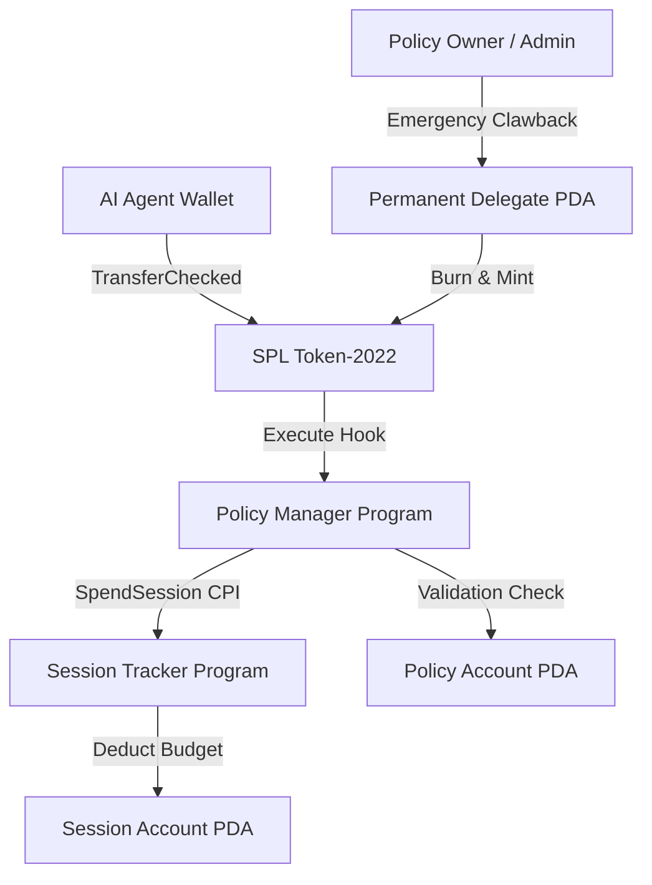

# Aperture v2 — Policy & Session Management Engine for AI Agents on Solana

**Aperture v2** is an infrastructure protocol built on Solana Anchor and SPL Token-2022. It enables autonomous AI agents to execute token transfers within enforced security policies (daily spending limits, single transaction caps, recipient allowlists, hourly velocity limits) and time-bound session budgets.

---

## Key Features

1. **SPL Token-2022 Transfer Hook Enforcement**:
   - Every token transfer initiated by an agent is intercepted on-chain by the `policy-manager` program.
   - Enforces per-transaction limits, daily spending limits, recipient allowlists, and velocity caps (max transactions per hour).

2. **Autonomous Session Budgets**:
   - The `session-tracker` program manages time-bounded sub-budgets for autonomous agents.
   - Automatically deducts spent amounts via Cross-Program Invocations (CPI) during transfer hook execution.

3. **Permanent Delegate Emergency Clawback**:
   - Policy owners maintain permanent delegate authority to reclaim funds from compromised or runaway agent wallets instantly.

4. **TypeScript SDK (`@aperture-finance/sdk`)**:
   - `PolicyManagerClient`: Policy creation, updates, pause/resume, and clawback helpers.
   - `SessionTrackerClient`: Session budget management.
   - `AgentPolicyGuard`: Client-side pre-flight validation middleware.
   - `AutoSessionRenewer`: Automatic session renewal background worker.

---

## Architecture Overview



---

## Repository Layout

```text
├── gateway/               # Governed OpenRouter LLM Gateway proxy engine (ElysiaJS + Prisma)
│   ├── src/                 # Gateway router & policy enforcement pipeline
│   └── prisma/              # Prisma schema for models, providers, logs & policies
├── programs/
│   ├── policy-manager/      # Anchor program for agent policies & SPL transfer hook
│   └── session-tracker/     # Anchor program for time-bounded session budgets
├── webapp/                  # Governed Next.js dashboard & fleet management
├── sdk/
│   ├── src/                 # TypeScript SDK source code
│   │   ├── policy.ts        # PolicyManagerClient
│   │   ├── session.ts       # SessionTrackerClient
│   │   ├── transferHook.ts  # TransferHookHelper
│   │   └── middleware/      # AgentPolicyGuard & AutoSessionRenewer
│   └── tests/               # SDK integration test suite
├── examples/
│   └── demo.ts              # End-to-end AI Agent demonstration script
├── tests/
│   └── aperture.ts          # Anchor on-chain program compliance test suite
├── scripts/
│   ├── build.sh             # Build script for WSL / Linux
│   └── test.sh              # Localnet test suite runner
└── Anchor.toml              # Anchor workspace configuration
```

---

## Quickstart & Testing

### Prerequisites
- Node.js (v18+)
- Rust & Solana CLI (v1.18+)
- Anchor CLI (v0.30+)
- WSL2 (Ubuntu) for Windows users

### 1. Build Programs
```bash
bash scripts/build.sh
```

### 2. Run Integration & SDK Test Suite (14 Tests)
```bash
bash scripts/test.sh
```

---

## TypeScript SDK Usage Example

```typescript
import {
  PolicyManagerClient,
  SessionTrackerClient,
  AgentPolicyGuard,
  PolicyParams,
} from "@aperture-finance/sdk";
import { PublicKey, Keypair } from "@solana/web3.js";
import BN from "bn.js";

// Initialize SDK Clients
const policyClient = new PolicyManagerClient(policyManagerProgram);
const sessionClient = new SessionTrackerClient(sessionTrackerProgram);

// 1. Create a Policy for an AI Agent
const params: PolicyParams = {
  dailyLimit: new BN(100 * 1_000_000_000),  // 100 SOL daily limit
  perTxLimit: new BN(20 * 1_000_000_000),   // 20 SOL max per tx
  allowlist: [approvedRecipient],           // Approved recipient
  velocityMaxTxPerHour: 10,                 // Velocity cap
};

const { policyPDA } = await policyClient.createPolicy(ownerKeypair, agentPublicKey, params);

// 2. Pre-flight Guard Check before sending transaction
const policyState = await policyClient.getPolicy(policyPDA);
AgentPolicyGuard.validatePreflight(policyState, new BN(5 * 1_000_000_000), approvedRecipient);

// 3. Open Autonomous Session Budget
const { sessionPDA } = await sessionClient.openSession(
  ownerKeypair,
  policyPDA,
  sessionIdPublicKey,
  new BN(50 * 1_000_000_000),
  new BN(now),
  new BN(now + 3600),
  true
);
```

---

## Verification & Compliance

All 14 workspace integration tests pass:
- **ExtraAccountMetaList Initialization**: Verified
- **Policy Creation & State Management**: Verified
- **Transfer Hook Enforcement**: Verified
- **Single Tx Limit Rejection**: Verified
- **Allowlist Rejection**: Verified
- **Session Budget Creation & Deductions**: Verified
- **Permanent Delegate Emergency Clawback**: Verified
- **TypeScript SDK Client Suite**: Verified
- **End-to-End AI Agent Demo**: Verified

---

## License

MIT License. Built by Aperture Finance.
