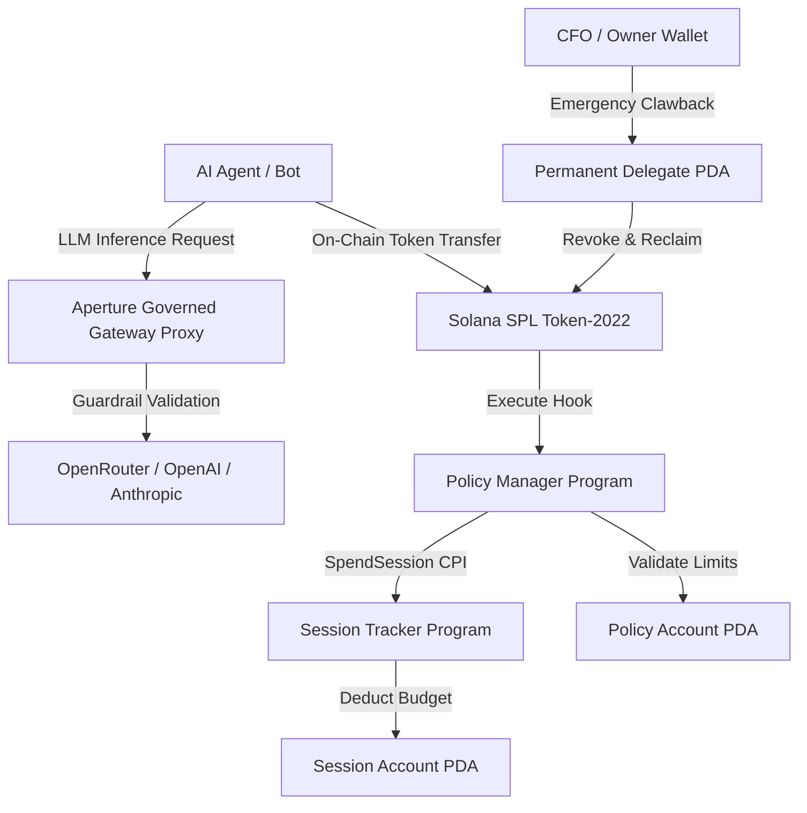

# 🚀 Aperture: Policy & Session Governance Protocol for Autonomous AI Agents on Solana

**Aperture** is an enterprise-grade infrastructure protocol and control center built on **Solana Anchor** and **SPL Token-2022**. It empowers autonomous AI agents to operate as independent economic actors while enforcing **hard, immutable security policies** (daily spend caps, single transaction limits, recipient allowlists, velocity controls) and **time-bound ephemeral session budgets**.

---

## 🎯 Executive Summary & Competitive Advantage

Existing AI model aggregators (e.g., OpenRouter) and traditional Web3 wallets fail to address the core requirements of autonomous agentic finance:
- **OpenRouter & API Proxies**: Enforce basic API credit limits, but have **zero visibility or control** over Web3 smart contracts, token transfers, velocity caps, or enterprise Role-Based Access Control (RBAC).
- **Standard Web3 Wallets**: Require manual human signatures for every transaction—breaking autonomous execution—or force teams to share raw private keys with bots, exposing assets to prompt injection attacks.

**Aperture solves this via a Dual-Layer Governance Architecture**:
1. **Governed AI Gateway Engine**: Intercepts LLM inference calls (OpenAI, Anthropic, Gemini) via Virtual API Keys (`aptr_live_...`) to enforce token budgets and model permissions before calling upstream providers.
2. **On-Chain Solana Governance Engine**: Leverages **SPL Token-2022 Transfer Hooks** and Anchor smart contracts (`policy-manager`, `session-tracker`) to enforce mathematical limits on-chain at the validator level.

---

## ⚔️ Feature Comparison Matrix

| Feature / Capability | **Aperture** 🛡️ | **OpenRouter** 🌐 | **LangChain / AutoGPT** 🤖 | **Standard Web3 Wallets** 👛 |
| :--- | :---: | :---: | :---: | :---: |
| **Web3 Native Wallet Governance** | **Yes (Solana SPL Token-2022)** | ❌ No | ❌ No | ⚠️ Uncontrolled |
| **SPL Token-2022 Transfer Hook Enforcement** | **Yes (On-Chain Validation)** | ❌ No | ❌ No | ❌ No |
| **Governed Virtual API Keys (`aptr_live_...`)** | **Yes** | ⚠️ Basic Credit Cap | ❌ No | ❌ No |
| **On-Chain Velocity Limits (tx/hr)** | **Yes** | ❌ No | ❌ No | ❌ No |
| **Time-Bounded Self-Destructing Sessions** | **Yes** | ❌ No | ❌ No | ❌ No |
| **Hierarchical Budget Delegation Trees** | **Yes (Master → Sub-Agents)** | ❌ No | ❌ No | ❌ No |
| **Enterprise RBAC (Owner, CFO, Dev, Auditor)** | **Yes** | ❌ No | ❌ No | ❌ No |
| **Permanent Delegate Emergency Clawback** | **Yes (Instant Clawback)** | ❌ No | ❌ No | ❌ No |

---

## 🖥️ Platform Modules & Page-by-Page Overview

### 1. Central Executive Dashboard (`/dashboard`)
Command center tracking active agents, virtual key telemetry, 30-day spend trends (LLM compute vs. on-chain tx fees), and real-time request status streams (`APPROVED`, `BLOCKED_RATE_LIMIT`, `ESCALATED_PENDING`).

### 2. Governed AI Gateway (`/gateway`)
Generates scoped Virtual API Keys (`aptr_live_...`) for AI agents. Enforces 7 guardrail checks (time of day, model permissions, rate limits, daily budget, per-request caps) before forwarding prompts to LLM providers. Includes an interactive live prompt testing playground.

### 3. On-Chain Spending Rules (`/policies`)
Binds Solana wallet addresses to agent identities and provisions Anchor `policy-manager` accounts. Configures daily SOL/USDC limits, per-tx limits, velocity caps (max tx/hr), and smart contract recipient allowlists.

### 4. Autonomous Session Budgets (`/sessions`)
Allocates time-boxed sub-budgets (e.g., 10 SOL for 2 hours) to autonomous agents. Uses `session-tracker` Cross-Program Invocations (CPI) to deduct spend automatically and self-destruct upon expiration.

### 5. Budget Delegation Visualizer (`/delegation`)
Renders a multi-node hierarchical graph mapping Master Orchestrator Agents (Depth 0) to child Sub-Agents (Depth 1+), tracking delegated utilization percentages across multi-agent workflows.

### 6. Corporate Treasury Vault (`/treasury`)
Macro-level financial dashboard featuring daily/monthly treasury utilization gauges, spend velocity forecasting engines (SOL/hr and 24h/30d runway projection), and departmental budget allocations.

### 7. Organization Governance & Roles (`/org` & `/roles`)
Enterprise Role-Based Access Control (RBAC) connecting wallet signatures to defined permissions: Owner (0), CFO (1), Team Lead (2), Developer (3), and Auditor (4).

### 8. Company Fleet (`/company`)
Tabular view listing every deployed agent in the organization, daily spend metrics, and a single-click global Emergency Kill Switch.

---

## 🏗️ Architecture & Component Flow



---

## 📁 Repository Structure

```text
├── gateway/               # Governed LLM Proxy Gateway (ElysiaJS + Prisma)
│   ├── src/                 # Gateway router & policy enforcement pipeline
│   └── prisma/              # Prisma schema for models, logs & virtual keys
├── programs/
│   ├── policy-manager/      # Anchor program for agent policies & SPL transfer hook
│   └── session-tracker/     # Anchor program for time-bounded session budgets
├── webapp/                  # Production Next.js 16 (Turbopack) dashboard & control center
├── sdk/                     # TypeScript SDK (@aperture-finance/sdk)
│   ├── policy.ts            # PolicyManagerClient
│   ├── session.ts           # SessionTrackerClient
│   └── middleware/          # AgentPolicyGuard & AutoSessionRenewer
├── examples/                # End-to-end AI agent usage scripts
└── scripts/                 # Anchor program build and compliance test suites
```

---

## 🚀 Quickstart & Testing

### Build Solana Programs
```bash
bash scripts/build.sh
```

### Run Anchor & Integration Test Suite (14 Compliance Tests)
```bash
bash scripts/test.sh
```

---

## 📜 License

MIT License. Built by Aperture Finance.

