# Aperture architecture (as built, Phases 0–12)

Aperture is one control plane for how an organization's **people and AI agents spend money on AI**. Every rail enters through it: AI provider APIs, image and video generation, fiat cards, x402 stablecoin payments, and seats. Each spend is checked against budgets, policies and mandates, then approved, refused, or queued for a person, and charged to the right budget in one USD ledger with a hash-chained audit trail.

Snapshot of 2026-10-08. The design reasoning is in [plan/architecture](../plan/architecture/README.md) and the ADRs in [docs/adr](adr/README.md). This page shows what the code does today.

**Diagrams:**

1. [System context](#1-system-context)
2. [Services and deployment](#2-services-and-deployment)
3. [Monorepo: apps and packages](#3-monorepo-apps-and-packages)
4. [Money: four rails, one ledger](#4-money-four-rails-one-ledger)
5. [A governed gateway request](#5-a-governed-gateway-request)
6. [A card authorization](#6-a-card-authorization)
7. [An x402 payment on Solana](#7-an-x402-payment-on-solana)
8. [Authority: policies, approvals, mandates, audit](#8-authority-policies-approvals-mandates-audit)
9. [Visibility: posture, inventory, seats, attestations (Phases 11–12)](#9-visibility-posture-inventory-seats-attestations-phases-1112)
10. [Data model](#10-data-model)

Then: [background jobs](#background-jobs), [trust boundaries and secrets](#trust-boundaries-and-secrets), [invariants](#invariants).

---

## 1. System context

Who talks to Aperture, and what Aperture talks to.

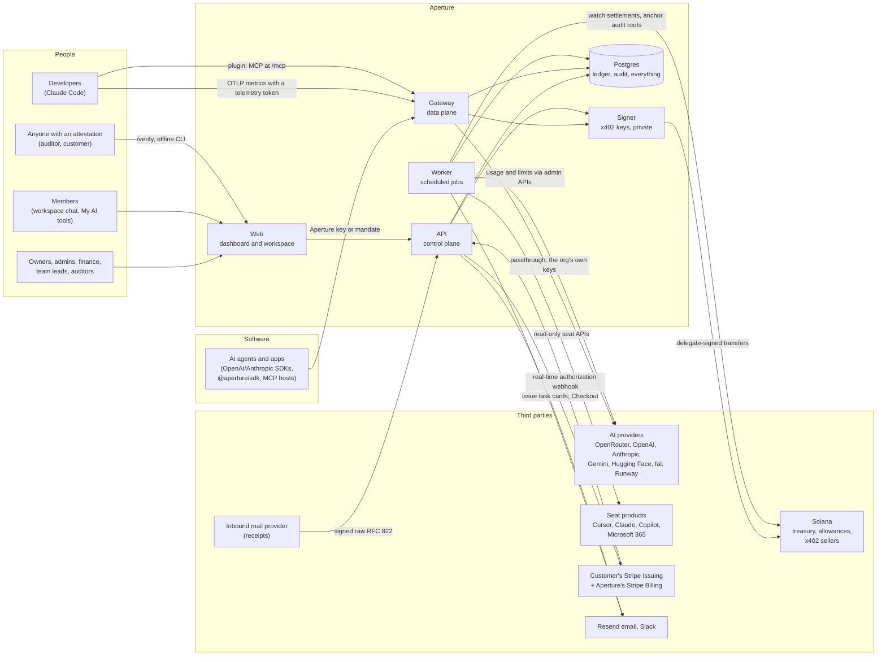

**Two planes.**

- The **gateway** decides every request in real time and must stay fast. It is fail-closed: if it can't decide, it refuses.
- The **API** is where people configure and review things, and where Stripe and the inbound mail provider call back in.
- Both share one Postgres. That's where every hold, capture, decision and audit event is written.

---

## 2. Services and deployment

Five deployable apps share one database. The only network path between them is the signer, which is private.

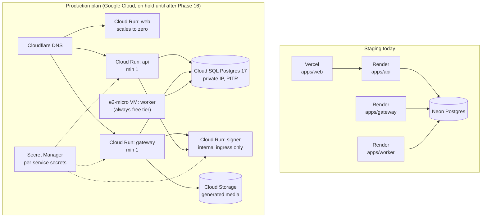

| App            | Does                                                                                                                                                                                                                                                                                     | Talks to                                                                               |
| -------------- | ---------------------------------------------------------------------------------------------------------------------------------------------------------------------------------------------------------------------------------------------------------------------------------------- | -------------------------------------------------------------------------------------- |
| `apps/web`     | Next.js App Router: dashboard, workspace chat and media, My AI tools, public `/verify` and shared attestations                                                                                                                                                                           | API only, through typed `openapi-fetch` clients generated from `docs/api/openapi.json` |
| `apps/api`     | Hono + zod-openapi control plane. It serves 140 operations: orgs, members, teams, budgets, policies, agents, keys, connections, approvals, mandates, cards, x402, posture, inventory, attestations, seats, receipts, billing. It also serves the Stripe, Slack and inbound-mail webhooks | Postgres, signer, Stripe, Resend, Slack                                                |
| `apps/gateway` | The data plane: OpenAI-, Anthropic- and Gemini-format passthrough, images and videos, `/v1/x402`, the agent's own `/v1/me`, `/v1/card` and `/v1/approvals`, MCP over HTTP at `/mcp`, and OTLP telemetry ingest at `/otlp/v1/*`                                                           | Postgres, providers, signer                                                            |
| `apps/worker`  | Runs the pg-boss-backed scheduler (see [jobs](#background-jobs)). The API can run the same jobs with `RUN_WORKER=true`                                                                                                                                                                   | Postgres, providers' admin APIs, seat APIs, Solana RPC, email and Slack                |
| `apps/signer`  | Holds the x402 delegate keys, encrypted under their own KEK. It signs only transfers that match an approved hold, and has no public URL                                                                                                                                                  | Postgres, Solana RPC                                                                   |

Self-hosting uses `infra/compose.selfhost.yml`: Caddy, two replicas each of the API and gateway, the worker, the signer on an internal network, and Postgres with WAL-G backups.

---

## 3. Monorepo: apps and packages

pnpm workspaces and Turborepo, all TypeScript. Logic sits in packages so the apps stay thin. `@aperture/core` is pure: it does no I/O and is property-tested.

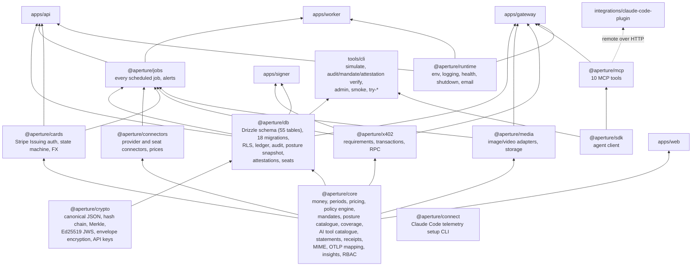

Code checks: `pnpm check` runs format, lint, typecheck, unit, property, fuzz and integration tests on Testcontainers Postgres, knip, and a guard against imports from `legacy/`.

---

## 4. Money: four rails, one ledger

All money is integer **micro-USD** (1 µUSD = 1 USDC atomic unit). Every rail uses the same **authorize → capture** pattern:

1. Place a **hold** on every budget on the principal's path (agent → team → org), all or nothing.
2. **Capture** the actual cost, or **release** the hold.

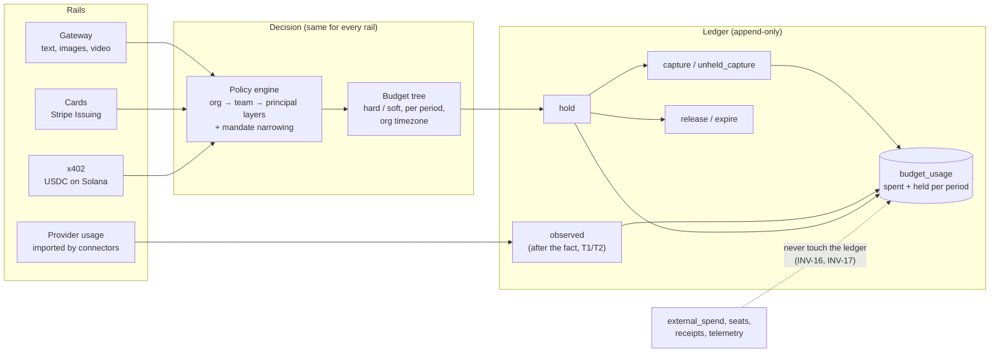

**Enforcement tiers:**

| Tier                     | Where                                                       | What Aperture can do                                                                     |
| ------------------------ | ----------------------------------------------------------- | ---------------------------------------------------------------------------------------- |
| **Enforced**             | Gateway, managed cards, x402 allowances under a hard budget | Decide before the money moves                                                            |
| **T2 (provider limits)** | Keys Aperture created at OpenRouter, OpenAI and others      | Mirror the remaining budget as the provider-side key limit, and revoke it when exhausted |
| **T1 (visible)**         | Imported provider usage                                     | See it, alert on it, charge it after the fact                                            |
| **External**             | Statements, receipts, declarations, seats                   | Evidence only: shown in inventory, coverage and posture, never in budgets                |

---

## 5. A governed gateway request

An agent calls `POST /v1/chat/completions` with its Aperture key. Nothing reaches the provider until policy and budget say yes.

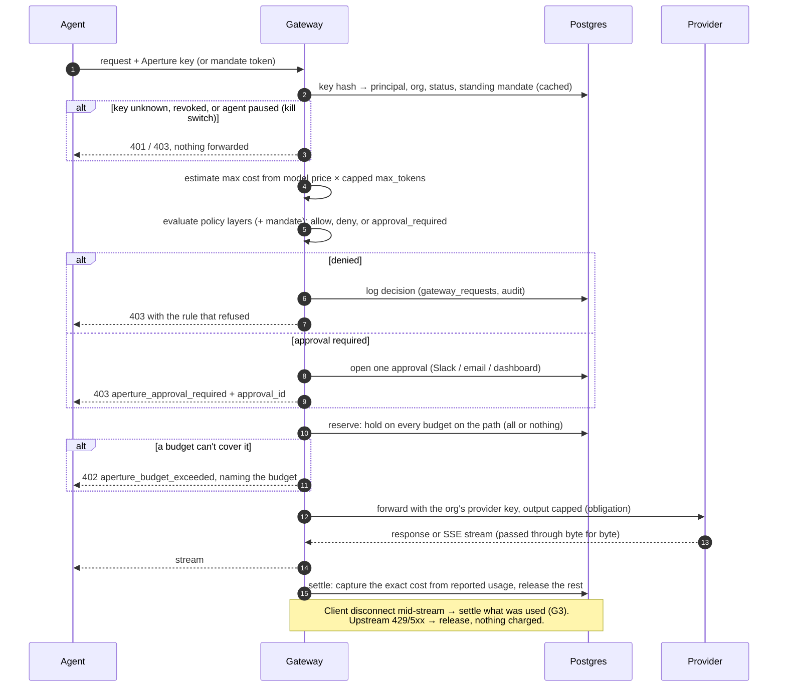

Images and videos follow the same pattern, but the hold stays open while a background poller (`media.poll`) waits for the job. The poller stores the result privately and settles the reported cost.

---

## 6. A card authorization

Stripe Issuing asks the customer's endpoint, live, whether to approve each card swipe. Aperture answers from the ledger within Stripe's time limit. A timeout counts as a decline.

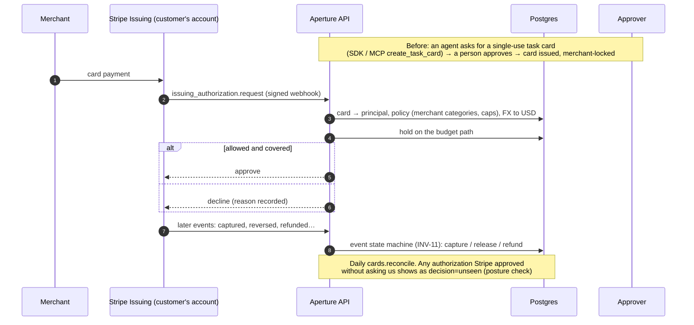

The card number never touches Aperture's servers (bring your own issuer, ADR 0017).

---

## 7. An x402 payment on Solana

An agent pays an HTTP 402 API in USDC from a company budget account. Aperture never holds the funds:

- The treasury gives each agent's budget account an on-chain **SPL delegate allowance**: a hard cap enforced by Solana itself.
- Aperture's **signer** co-signs only transfers that match an approved hold.

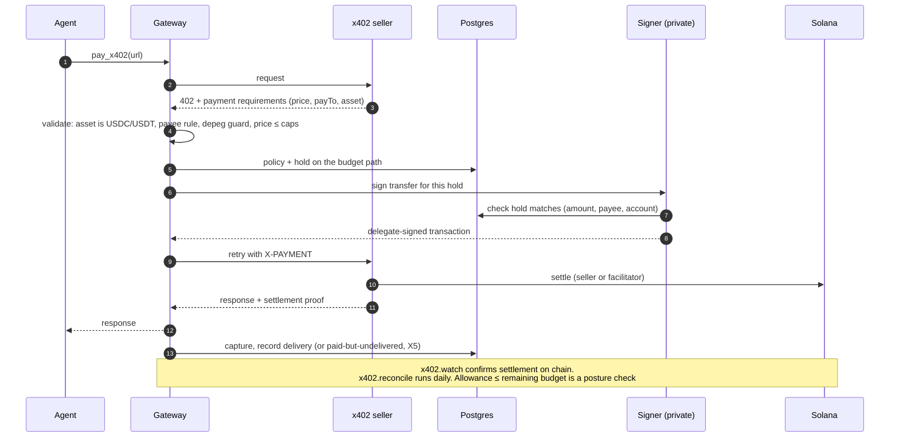

---

## 8. Authority: policies, approvals, mandates, audit

Who may spend what, who can say yes, and the record that proves it.

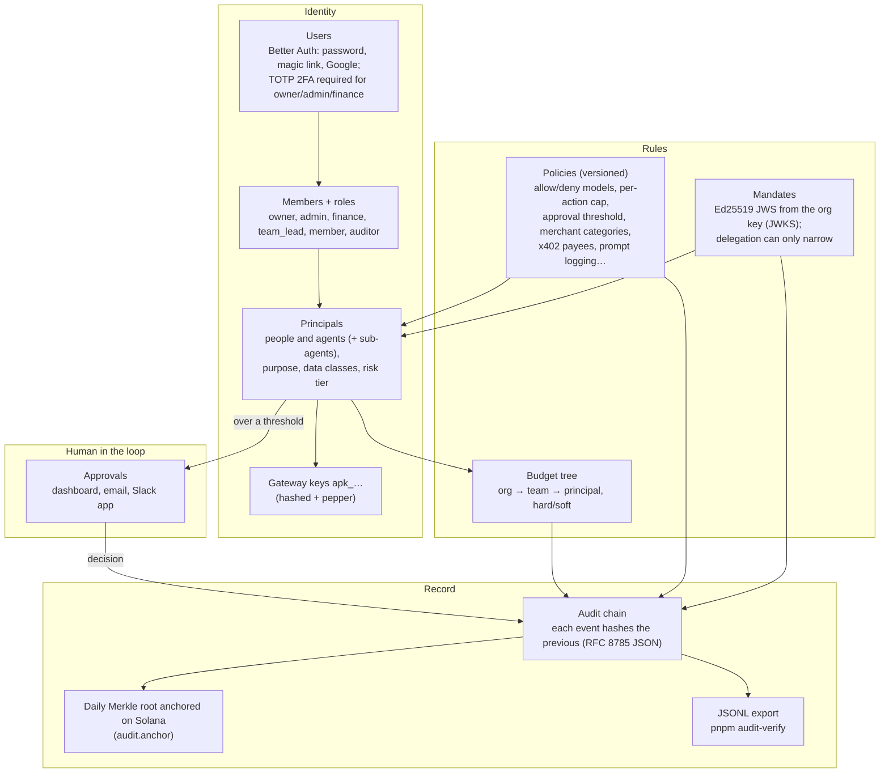

**Row-level security.**

- Every org table has an RLS policy that keys on `app.org_id`.
- The services connect as a non-superuser role (`aperture_app`).
- `withOrg(db, orgId, fn)` sets the org for the transaction, and `withSystem` is used only by jobs.
- So a bug in one route can't read another org's rows. Tests check this for every table.

---

## 9. Visibility: posture, inventory, seats, attestations (Phases 11–12)

The visibility layer reads what the enforcement layer recorded, and adds evidence about AI that never touches an Aperture key. Nothing in this layer moves money or writes to the ledger.

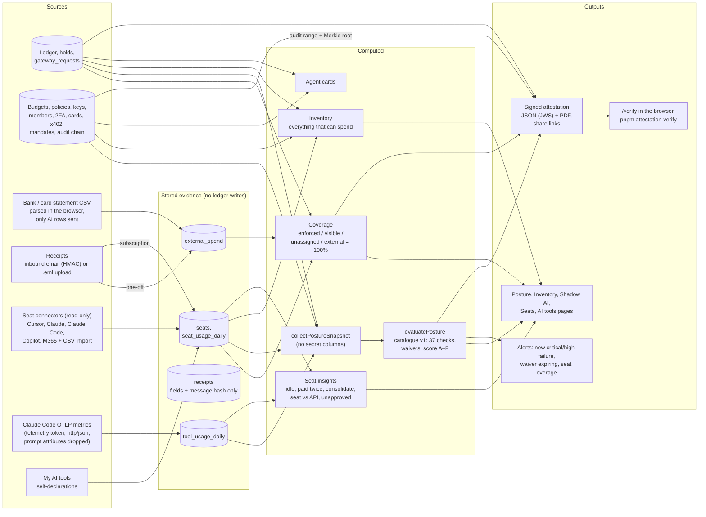

**Attestation trust.**

- On Aperture Cloud, the platform key (Ed25519, envelope-encrypted) signs attestations and agent cards. A self-hosted install signs with its own instance key and says so.
- Every key, current and retired, is published at `/.well-known/aperture/jwks.json`, so old attestations keep verifying after a rotation.
- Verifiers check the JWS `typ` and the payload `type`, so an agent card can't pass as an attestation.

---

## 10. Data model

The main tables and how they relate. There are 55 tables in all; the ones below carry the domain. Every table except the global ones (`users`, `platform_signing_keys`, `fx_rates`, `model_prices`) has an `org_id` with RLS.

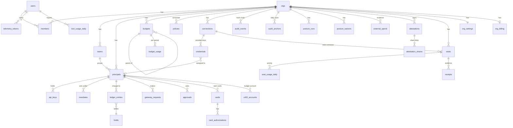

---

## Background jobs

One scheduler (`packages/jobs`) runs them in the worker. pg-boss locking makes each job run once even with several workers.

| Job                                       | Every             | Does                                                                      |
| ----------------------------------------- | ----------------- | ------------------------------------------------------------------------- |
| `connector.sync`                          | 1 min             | Import provider usage, mirror T2 limits, revoke exhausted keys            |
| `alerts.scan`, `alerts.dispatch`          | 1 min, 30 s       | Budget thresholds; send queued alerts (email, Slack)                      |
| `holds.expire`                            | 30 s              | Release or settle expired holds                                           |
| `media.poll`                              | 10 s              | Finish image and video jobs, store privately, settle                      |
| `approvals.notify`, `approvals.expire`    | 15 s, 5 min       | Notify approvers; expire stale requests                                   |
| `prices.sync`, `prices.stable`, `fx.sync` | daily, 5 min, 6 h | Model prices, stablecoin prices (depeg guard), FX rates                   |
| `cards.expire`, `cards.reconcile`         | 10 min, daily     | Close expired task cards; reconcile with Stripe                           |
| `x402.watch`, `x402.reconcile`            | 20 s, daily       | Confirm settlements on chain; reconcile                                   |
| `audit.anchor`                            | hourly            | Anchor each day's audit Merkle root on Solana                             |
| `ledger.verify`                           | daily             | Ledger totals equal budget usage (drift check)                            |
| `privacy.retention`, `privacy.deletions`  | daily, hourly     | Retention; org deletion after the grace period                            |
| `posture.run`                             | daily             | Posture per org; alert on new critical/high failures and expiring waivers |
| `seats.sync`                              | 6 h               | Read seats and activity from seat connectors                              |
| `seats.idle`                              | daily             | Mark seats idle or active from the org's threshold                        |
| `seats.overage`                           | daily             | Alert when seat overage passes the org's threshold                        |

---

## Trust boundaries and secrets

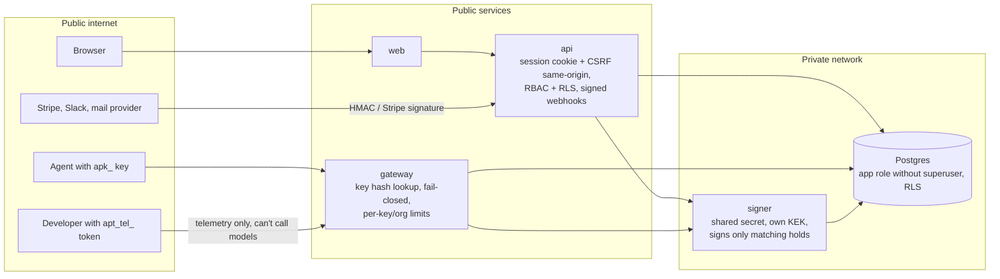

| Secret                                                                                                              | Protected by                                                                                                    |
| ------------------------------------------------------------------------------------------------------------------- | --------------------------------------------------------------------------------------------------------------- |
| Provider connection secrets, provider keys Aperture created, org mandate-signing keys, the platform attestation key | Envelope encryption under `APERTURE_KEK_V<n>`. Rotate with `admin rotate-kek`, which re-wraps every one of them |
| x402 delegate keys                                                                                                  | A separate `SIGNER_KEK_V<n>`, present only in the signer                                                        |
| Gateway keys (`apk_`), telemetry tokens (`apt_tel_`), share-link tokens                                             | Stored only as a peppered hash; shown once                                                                      |
| Card numbers                                                                                                        | Never on Aperture's servers (customer's issuer)                                                                 |
| Prompts                                                                                                             | Not logged by default; telemetry prompt attributes are dropped at ingest                                        |

## Invariants

The ones the tests enforce:

- **INV-1–4** (Phase 2, property-tested with real concurrency): a hard budget is never exceeded; counters equal a fold of the journal; holds reach one terminal state; repeated operations are idempotent.
- **INV-7, INV-8, INV-10:** policy monotonicity, scope intersection, and fail-closed evaluation (`evaluate(anything)` never allows and never throws).
- **INV-12:** the signer produces a signature only when every x402 check passes, and every transaction it signs passes the x402 Path 1 verifier rules.
- **INV-14:** replaying overlapping connector windows gives an identical ledger.
- **INV-15:** any edit to the audit chain is detected.
- **INV-11:** the card event state machine accepts events in any order, and they're idempotent.
- **INV-13:** a denied request never sends a byte upstream (fuzzed).
- **INV-16:** statements and external spend never touch `ledger_entries`, `holds` or `budget_usage`.
- **INV-17:** seats, receipts and telemetry never touch them either.
- **Fail closed:** every rail refuses when it can't decide (ADR 0010).
