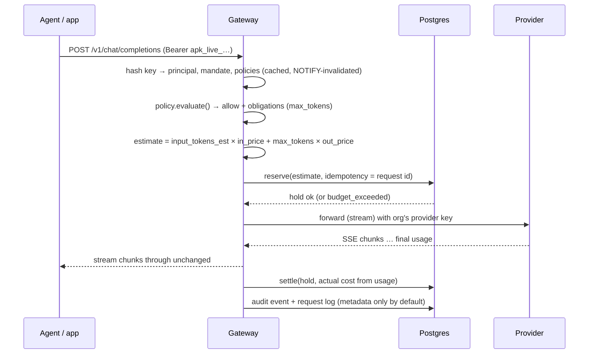
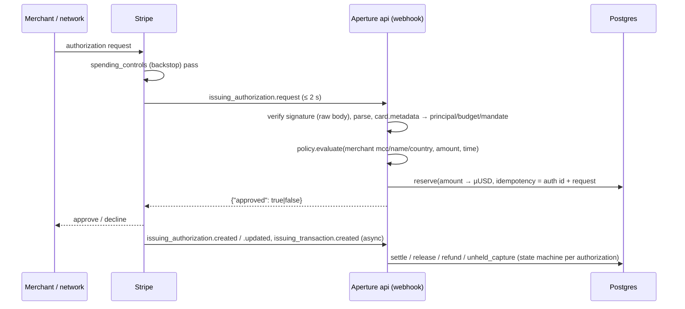

# Target architecture

This document builds the system step by step, from principles to each rail. Every mechanism here is stress-tested in [edge-cases/](../edge-cases/README.md), and every claim about a third party is sourced in [research/](../research/README.md).

## 1. Principles

1. **Own the control plane, not the rails.** Aperture holds identity, policy, budgets, approvals, mandates, and audit. Money stays in the customer's provider accounts, card program, and wallet.
2. **One ledger, one unit.** All spend, on every rail, is recorded in one double-entry-style ledger in **integer micro-USD** (`bigint`, 1 µUSD = 10⁻⁶ USD = 1 atomic unit of USDC/USDT).
3. **Authorize, then capture.** Every rail follows the card-network pattern: reserve an estimated amount (a *hold*) before the action, settle the actual amount after, release on failure.
4. **Hierarchy is checked on every action.** A spend is checked against its budget and **every ancestor** budget, so delegation can only narrow authority.
5. **Fail closed.** If Aperture can't decide, the answer is no (configurable per org only for the gateway, with a local cap).
6. **Deterministic core.** Policy evaluation and ledger math are pure functions over explicit inputs — easy to unit-test, property-test, and fuzz.
7. **Everything is audited, and the audit can't be quietly edited.** Hash-chained events, verifiable offline.
8. **Least agency.** Agent credentials can only call data-plane APIs within their mandate; they can never change policy.

## 2. System context

```
                    People (browser)                          AI agents / apps
                          │  session cookie                        │  Aperture key / mandate
                          ▼                                        ▼
┌────────────────────────────────────────────────────────────────────────────────────┐
│ Aperture                                                                           │
│                                                                                    │
│  apps/web (Next.js)  ──►  apps/api (control plane) ◄──── apps/gateway (data plane) │
│   dashboard,              orgs, members, budgets,        /v1/chat/completions,     │
│   workspace UI            policies, mandates,            /anthropic/v1/messages,   │
│                           approvals, audit, webhooks     /v1/images, /v1/videos,   │
│                                   │                      /v1/x402/authorize        │
│                                   ▼                              │                 │
│                     ┌──────── Postgres ───────────┐              │                 │
│                     │ ledger, budgets, policies,  │◄─────────────┘                 │
│                     │ holds, audit, pg-boss jobs  │                                │
│                     └─────────────┬───────────────┘                                │
│            apps/worker (jobs) ────┘        apps/signer (Solana signing, isolated)  │
└──────┬───────────────┬──────────────────┬───────────────────┬──────────────────────┘
       │ admin APIs    │ passthrough      │ Issuing API +     │ RPC + x402
       ▼               ▼                  ▼ auth webhooks     ▼
  OpenRouter,     OpenRouter, OpenAI,   Customer's Stripe   Solana: customer treasury,
  OpenAI, Anthro- Anthropic, Gemini,    Issuing / NymCard   per-agent budget token
  pic, Google,    HF, fal, Runway       program             accounts, x402 sellers &
  Hugging Face                                              facilitators
```

## 3. Repository layout (target)

Phase 1 created `apps/*`, `packages/config`, `packages/runtime`, `infra/`, `docs/adr/`, and `legacy/`. Every other package is created in the phase that implements it (ADR 0011).

```
aperture/
├── apps/
│   ├── web/          Next.js App Router — dashboard + workspace (chat/image/video)
│   ├── api/          Hono (Node) — control-plane REST API + inbound webhooks
│   ├── gateway/      Hono (Node) — data plane: AI passthrough, media jobs, x402 authorize
│   ├── worker/       pg-boss job runner — connector sync, limit mirroring, expiry, settlement
│   └── signer/       Minimal internal service that signs Solana transactions for approved holds
├── packages/
│   ├── core/         Pure domain: money, periods, ledger math, policy engine, mandates, cost estimation
│   ├── db/           Drizzle schema, migrations, repositories, transaction helpers
│   ├── connectors/   One module per external system (openrouter, openai, anthropic, google, hf,
│   │                 fal, runway, veo, stripe-issuing, nymcard, x402-solana)
│   ├── auth/         Better Auth config, RBAC helpers, key hashing
│   ├── crypto/       Envelope encryption, JCS canonicalization, hashing, Ed25519 JWS
│   ├── sdk/          @aperture/sdk — TypeScript client for agents (gateway, mandates, x402)
│   ├── mcp/          @aperture/mcp — MCP server exposing Aperture tools to agents
│   ├── ui/           Shared React components (shadcn/ui based)
│   ├── runtime/      Service bootstrap: env validation, redacting logger, health routes, shutdown
│   └── config/       Shared tsconfig (ESLint/Prettier configs live at the repo root)
├── tools/
│   ├── x402-test-seller/   Local x402 seller for devnet tests
│   ├── audit-verify/       CLI: verify an exported audit log offline
│   └── try/                Scripts used by the "try it yourself" sections
├── infra/            docker-compose files, Caddyfile, backup scripts
├── docs/             adr/, runbooks/, api/ (generated OpenAPI)
├── legacy/           Archived hackathon code (not built by CI)
└── plan/             This plan
```

## 4. Tech stack

| Concern | Choice | Why |
|---|---|---|
| Runtime | Node.js 24 LTS | Current LTS; same runtime everywhere |
| Language | TypeScript (strict, `noUncheckedIndexedAccess`) | One language across web, services, SDK |
| Monorepo | pnpm 11 workspaces + Turborepo | Conventional; pnpm blocks dependency install scripts by default and supports `minimumReleaseAge` (supply-chain defence) |
| Web | Next.js (App Router), Tailwind v4, shadcn/ui, TanStack Query, react-hook-form + Zod, Recharts | Mainstream React stack; no bespoke UI framework |
| Services | Hono on `@hono/node-server`, `@hono/zod-openapi` | Web-standard Request/Response makes streaming passthrough simple; OpenAPI generated from Zod |
| Database | PostgreSQL 17 | Transactions + row locks give a correct ledger without extra infrastructure |
| ORM / migrations | Drizzle ORM + drizzle-kit | Typed SQL, plain SQL migrations checked into git |
| Jobs | pg-boss | Queue in Postgres — no Redis needed at our scale |
| Auth | Better Auth (email/password, magic link, Google/Microsoft OAuth, organizations, SSO/SAML later) | Self-hosted, TypeScript, org support |
| Validation | Zod at every boundary | One schema for runtime validation and types |
| Logging / tracing | pino (with redaction) + OpenTelemetry | Structured, standard |
| Errors | Sentry (free tier) | |
| Solana | `@solana/kit` + `@solana-program/token`, `/memo`, `/compute-budget` | The maintained successor of web3.js v1 |
| Stripe | `stripe` (official Node SDK) | |
| Object storage | S3-compatible (Cloudflare R2 or MinIO self-hosted) | Generated images/videos, audit exports |
| Tests | Vitest, fast-check, Testcontainers, Playwright, k6 | See [testing/](../testing/README.md) |

## 5. Domain model

Tables (Drizzle, `packages/db`). All have `org_id` (except global catalogs), `created_at`, UUIDv7 ids.

| Table | Purpose | Key columns |
|---|---|---|
| `orgs` | Tenant | `name`, `timezone` (IANA, default `Asia/Dubai`), `fail_mode` (`closed`/`open_capped`), `display_currency` |
| `users`, `sessions`, `accounts`, `members` | Better Auth tables; `members.role` ∈ owner, admin, finance, team_lead, member, auditor | |
| `teams` | Grouping of members and agents | `name` |
| `principals` | Anyone who can spend: a member or an agent | `kind` (`user`/`agent`), `user_id`, `owner_user_id` (agents), `team_id`, `parent_principal_id` (sub-agents), `status` (`active`/`paused`/`revoked`) |
| `budgets` | Tree of spending limits | `parent_id`, `scope` (`org`/`team`/`principal`/`mandate`), `scope_id`, `unit` (`micros`/`count`), `period` (`day`/`week`/`month`/`none`), `limit_amount` (bigint), `mode` (`hard`/`soft`), `rails` (text[]), `alert_thresholds` (int[]) |
| `budget_usage` | Counters per budget per period | PK (`budget_id`, `period_key`), `held`, `spent` (bigint) |
| `holds` | Reservations | `principal_id`, `mandate_id`, `rail`, `amount`, `status` (`open`/`settled`/`released`/`expired_reconciling`), `idempotency_key` (unique), `external_ref`, `budget_ids` (uuid[]), `period_keys` (text[]), `expires_at` |
| `ledger_entries` | Immutable journal | `kind` (`hold`/`release`/`capture`/`unheld_capture`/`observed`/`refund`/`adjustment`), `amount`, `hold_id`, `rail`, `provider`, `resource` (model/merchant/payee), `principal_id`, `budget_ids`, `period_keys`, `external_ref`, `idempotency_key` (unique), `occurred_at`, `meta` (jsonb) |
| `policies` | Versioned rule documents | `scope`, `scope_id`, `version`, `document` (jsonb, Zod-validated), `active` |
| `mandates` | Signed, scoped delegations | `parent_id`, `issuer_user_id`, `subject_principal_id`, `scope` (jsonb), `budget_id`, `not_before`, `expires_at`, `max_uses`, `uses`, `status`, `jws` |
| `credentials` | Anything that lets a principal spend | `kind` (`aperture_key`/`provider_key`/`card`/`solana_delegate`), `principal_id`, `connection_id`, `prefix`, `secret_hash` (keys) or `external_id` (cards, provider keys), `status`, `managed_by_gateway` (bool) |
| `connections` | Links to external systems | `provider`, `status`, `secret_ciphertext`, `dek_ciphertext`, `kek_version`, `config` (jsonb), `capabilities` (jsonb), `sync_cursor`, `last_synced_at` |
| `approvals` | Human-in-the-loop requests | `requester_principal_id`, `request_fingerprint`, `amount`, `context` (jsonb), `status`, `decided_by`, `expires_at` |
| `media_jobs` | Async generation jobs | `provider`, `provider_job_id`, `hold_id`, `status`, `output_key` |
| `x402_payments` | Payment attempts | `hold_id`, `seller_origin`, `pay_to`, `asset`, `amount_atomic`, `memo_nonce`, `last_valid_block_height`, `tx_signature`, `status` |
| `price_catalog` | Model/media prices | `provider`, `model`, `unit`, prices as µUSD per unit (input, output, cache read/write, per image, per second), `effective_from`, `source` |
| `audit_events` | Hash chain | `seq` (per org, gapless), `actor`, `action`, `subject`, `decision`, `data` (jsonb), `prev_hash`, `hash` |
| `audit_anchors` | Daily roots | `day`, `merkle_root`, `anchor_tx` |
| `webhook_receipts` | Idempotency for inbound webhooks | `source`, `event_id` (unique), `received_at`, `processed_at` |

## 6. Money

- Type: `Micros` = branded `bigint`. Never `number`, never floats. Parsing from strings only (`"12.345678"` → `12345678n`), rejecting more than 6 decimals.
- Conversions: USD cents × 10⁴; USDC/USDT atomic units × 1 (6 decimals); provider prices stored as µUSD per unit with a rational multiplier for sub-micro prices (e.g. per-token prices like USD 0.0000025 → stored per **million** tokens: 2_500_000 µUSD / 1M tokens) and computed with `ceil` so estimates never under-count.
- Display: USD by default; AED at the fixed peg 3.6725 for display only. Card programs in EUR/GBP: convert at the day's rate (ECB feed), record `fx_rate` in `meta`, settle on the transaction's actual amount.
- Stablecoins are treated as 1:1 with USD. A depeg beyond a configurable threshold (default 2%) pauses the crypto rail (price from a public feed; **VERIFY** source in Phase 9).

## 7. Ledger and holds

### Operations

All run inside one Postgres transaction, touching `budget_usage` rows **locked in ascending `budget_id` order** (prevents deadlocks).

```
reserve(principal, amount, rail, idempotency_key, resource, mandate?)
  1. If a hold with this idempotency_key exists → return it (idempotent retry).
  2. path ← budgets that apply: the principal's budget + all ancestors
           + the mandate's budget (if any) + rail-specific budgets; filter by `rails`.
  3. period_key per budget ← period of now() in the org timezone.
  4. INSERT budget_usage rows ON CONFLICT DO NOTHING; SELECT … FOR UPDATE (ordered).
  5. For each hard budget: if spent + held + amount > limit → abort, reason = that budget.
     For count budgets (velocity): amount = 1.
  6. INSERT hold (status open, expires_at by rail); INSERT ledger_entry(kind=hold).
  7. UPDATE budget_usage SET held = held + amount for each budget in path.
  8. After commit: enqueue alerts for soft budgets crossing thresholds; enqueue limit mirroring.

settle(hold_id, actual, external_ref)
  lock the same rows (budget_ids, period_keys stored on the hold — spend stays in the
  period it was reserved in, even if it settles after midnight);
  held -= hold.amount; spent += actual; ledger_entry(kind=capture, amount=actual);
  if actual > hold.amount → flag `overage` in meta and alert (the money is already spent).

release(hold_id)            held -= hold.amount; ledger_entry(kind=release).
record_unheld(principal, actual, …)   spent += actual with no hold (card force capture,
                            observed provider usage). Always succeeds; if it pushes a hard
                            budget over, trigger the rail's revoke/freeze action + alert.
refund(original_ref, amount) spent -= amount in the original period if still current,
                            otherwise the current period; ledger_entry(kind=refund).
```

### Invariants (property-tested in Phase 2)

- **I1**: For every hard budget and period, `held + spent_from_holds ≤ limit` after any interleaving of `reserve/settle/release` where `actual ≤ hold`. (Unheld captures and overages are the only way over, and they are always flagged.)
- **I2**: `budget_usage` equals the fold of `ledger_entries` for that budget and period (counters are a cache, the journal is the truth). A nightly job recomputes and alerts on drift.
- **I3**: Every hold ends in exactly one terminal state (`settled`, `released`) or is `expired_reconciling` with an open reconciliation task.
- **I4**: Idempotency — replaying any operation with the same key changes nothing.

### Hold lifetimes by rail

| Rail | Hold TTL | On expiry |
|---|---|---|
| Gateway text | 10 min | settle at hold amount (conservative) + reconcile later |
| Media job | provider max duration + 30 min | `expired_reconciling`; worker asks the provider for the job's final state |
| Card authorization | follows Stripe/NymCard authorization state (up to 31 days) | released when the processor reports reversal/expiry |
| x402 payment | until `lastValidBlockHeight` + 150 slots margin | released if no matching on-chain transfer is found |

## 8. Budgets and periods

- The budget tree mirrors the org: `Org (monthly, hard)` → `Team (monthly)` → `Member or Agent (daily + monthly)` → `Sub-agent or Mandate (none, i.e. lifetime)`.
- A principal can have several budgets (e.g. daily **and** monthly); all apply.
- **Overbooking is allowed** (children's limits may sum to more than the parent's); safety comes from checking ancestors at spend time. An optional *allocated* mode subtracts a child's limit from the parent at creation for teams that want hard partitions.
- Periods are computed in the org's IANA timezone: `day` → `2026-09-23`, `week` → ISO week `2026-W39`, `month` → `2026-09`, `none` → `all`. DST transitions are handled by the timezone library (Dubai has no DST; other orgs may).
- **Velocity** (e.g. "max 20 card purchases per hour") is a `count` budget with `period` = fixed window (`hour`), checked in the same transaction — no separate racy counter.

## 9. Policy engine

`packages/core/policy` — a pure function:

```ts
evaluate(input: DecisionInput): Decision
// DecisionInput: principal, org, team, mandate?, action, rail, provider?, model?,
//   amount (µUSD), merchant? {name, mcc, country}, payee? {origin, payTo, network, asset},
//   time (instant + org tz), policies[] (org → team → principal → mandate, all active versions)
// Decision: { outcome: 'allow' | 'deny' | 'require_approval', reasons: Reason[],
//             obligations: { maxTokens?, promptLogging?, cardControls? } }
```

### Rule types (v1)

| Rule | Example | Applies to |
|---|---|---|
| `allow_providers` / `deny_providers` | only `openrouter`, `anthropic` | gateway, connectors |
| `allow_models` / `deny_models` | `openai/gpt-5*`, `anthropic/claude-*` (exact or trailing `*` only — keeps subset checks decidable) | gateway |
| `max_amount_per_action` | USD 5 per request, USD 200 per card purchase | all rails |
| `approval_threshold` | card purchases over USD 500 need Finance | all rails |
| `time_window` | Sun–Thu 08:00–20:00 Asia/Dubai | all rails |
| `merchant_categories` | allow `airlines_air_carriers`, `hotels_motels_and_resorts` | cards |
| `merchant_countries` | allow `AE`, `US` | cards |
| `x402_payees` | `{ origin: "api.example.com", payTo: "…", network: "solana:…", asset: USDC }` | x402 |
| `max_tokens` | cap output at 4,096 | gateway (becomes an obligation) |
| `prompt_logging` | `off` / `metadata` / `full` | gateway, workspace |
| `media_limits` | max 10 s video, max 4 images per request | media |

### Evaluation

1. Collect every active policy on the scope chain: org → team → principal (and its ancestors for sub-agents) → mandate.
2. A request must satisfy **every level** (intersection). Any `deny` → **deny**. Otherwise any triggered `approval_threshold` → **require_approval**. Otherwise **allow**.
3. Obligations merge by taking the most restrictive value (smallest `maxTokens`, strictest logging).
4. Reasons carry `{ruleId, level, message}` for the UI, the API error, and the audit log.
5. Budgets are **not** checked here — the ledger `reserve` does that inside the transaction. Policy answers "is this kind of action allowed"; the ledger answers "is there money".

Properties tested: adding a deny rule never turns deny into allow (monotonicity); a mandate's decisions are a subset of its parent's; evaluation is deterministic for equal inputs.

## 10. Mandates and delegation

A mandate is a human's signed grant of scoped authority to an agent (or from an agent to a sub-agent, within its own mandate).

```json
{
  "mid": "0192…",            "org": "0191…",
  "iss": "user:0190…",       "sub": "principal:0193…",
  "parent": "0192…|null",
  "scope": {
    "rails": ["gateway", "x402"],
    "providers": ["openrouter"], "models": ["anthropic/claude-*"],
    "payees": [{ "origin": "data.example.com", "payTo": "8x…", "asset": "USDC" }],
    "maxPerAction": "5000000"
  },
  "budget": { "limit": "50000000", "period": "none" },
  "nbf": 1790000000, "exp": 1790086400, "maxUses": 200,
  "purpose": "Market research for Q4 campaign"
}
```

- Stored in `mandates` and signed as a compact **JWS (EdDSA/Ed25519)** with a per-org signing key (envelope-encrypted). Exportable, and verifiable by anyone with the org's public key. Later we can wrap the same content as an AP2-style Verifiable Credential.
- **Attenuation check** on creation: child ⊆ parent — rails ⊆, providers ⊆, every child model pattern is matched by a parent pattern, payees ⊆, `maxPerAction` ≤, budget ≤ parent's remaining, `exp` ≤ parent `exp`, `nbf` ≥ parent `nbf`, `maxUses` ≤ parent's remaining uses.
- **Enforcement**: each mandate gets its own `budget` node whose parent is the issuer-side budget, so ledger ancestry enforces the money part; the policy engine enforces the scope part.
- **Revocation** cascades to all descendants (recursive CTE) and to their credentials within one transaction; caches are invalidated via Postgres `LISTEN/NOTIFY`.
- **Use counting**: `uses` increments in the same transaction as `reserve` (execution-count revocation from the research).

## 11. Identity and credentials

| Principal | Authenticates with | Can call |
|---|---|---|
| Member (human) | Better Auth session cookie (email/password, magic link, Google/Microsoft; SAML later) | Control-plane API per role; workspace |
| Agent | **Aperture key** `apk_live_` + 32 random bytes (base62), shown once; stored as HMAC-SHA-256 with a server pepper; first 12 chars kept as a display prefix | Data plane only: gateway, media, x402 authorize, `GET /v1/me/budget`, `POST /v1/approvals` (request) |
| Member via API | Personal Aperture key bound to their principal | Same as agent, within the member's budget |
| External systems | Webhook signatures (Stripe `Stripe-Signature`, Slack signing secret, NymCard **VERIFY** scheme) | Webhook endpoints only |

Role permissions (control plane):

| Action | Owner | Admin | Finance | Team lead | Member | Auditor |
|---|---|---|---|---|---|---|
| Manage org, connections, SSO | ✓ | ✓ | | | | |
| Budgets (whole org) | ✓ | ✓ | ✓ | own team subtree | | read |
| Policies | ✓ | ✓ | ✓ | own team (within org policy) | | read |
| Approve requests | ✓ | ✓ | ✓ | own team, below threshold | | |
| Create agents, keys, mandates | ✓ | ✓ | | own team | own agents within own budget | |
| Kill switch | ✓ | ✓ | ✓ | own team | own agents | |
| Spend explorer | ✓ | ✓ | ✓ | own team | own | ✓ |
| Audit export & verify | ✓ | ✓ | ✓ | | | ✓ |

Separation of duties: nobody approves their own request; the approver must have authority over the budget the request draws on.

## 12. Enforcement tiers

| Tier | Meaning | Latency to stop spend | Where |
|---|---|---|---|
| **T0 inline** | Aperture decides before the money moves | 0 (the action never happens) | Gateway, media jobs, Stripe real-time auth, x402 signer |
| **T1 provider-native** | The provider enforces a limit Aperture keeps updated ("limit mirroring") | 0 for that credential; mirror staleness bounded by job lag | OpenRouter key `limit`, Stripe `spending_controls` backstop, NymCard velocity limits, SPL delegate allowance |
| **T2 detect & revoke** | Aperture sees usage after the fact and revokes the credential | provider reporting lag + 1 min (≈ 2–10 min) | OpenAI, Anthropic |
| **T3 visibility** | Aperture only reports | hours | Google budgets, Hugging Face, card statements |

The UI shows each credential's tier so nobody mistakes visibility for control.

## 13. Rails

### Rail 1 — AI gateway (text)

Passthrough endpoints (no model translation): OpenAI-compatible `POST /v1/chat/completions`, `/v1/responses`, `/v1/embeddings`; Anthropic-native `POST /anthropic/v1/messages`; Gemini-native `POST /google/v1beta/models/{model}:generateContent`; OpenRouter as the default upstream for OpenAI-compatible calls. The upstream credential is the org's (BYOK) provider key from `connections`, never the operator's.



Details:
- **Estimation**: input tokens ≈ `ceil(utf8_bytes / 3)` (deliberately over-counts; Arabic and code tokenize worse than English) + per-image input maximums; output = `max_tokens` after the policy cap. If the client didn't set `max_tokens`, the gateway **injects** the policy default so every request has a bounded cost.
- **Settlement**: OpenRouter returns `usage.cost` directly. For direct providers: tokens × catalog prices, including cached, cache-write, and reasoning tokens.
- **Errors**: upstream error before any output → release. Client disconnects mid-stream → abort upstream, settle at the hold amount, enqueue reconciliation (OpenRouter `/generation?id=`).
- **Responses**: headers `x-aperture-request-id`, `x-aperture-cost-usd`, `x-aperture-budget-remaining-usd`. Denials use the provider's error shape with `type` `aperture_policy_denied` (403), `aperture_budget_exceeded` (402), or `aperture_approval_required` (403 with `approval_id`). Never 429 for budget, because SDKs retry 429s automatically.
- **Kill switch**: principal status `paused` → every request denied within the cache TTL (≤ 2 s via NOTIFY).

### Rail 1b — Media jobs (image, video)

Images are usually synchronous (fal, OpenRouter image models, OpenAI images): same flow as text with a per-image price. Video is asynchronous:

1. `POST /v1/videos` → policy (duration/resolution limits) → estimate = seconds × price/sec × count → reserve (TTL = provider max + 30 min).
2. Submit to provider (Veo long-running operation, Runway task, fal queue with webhook) → store `media_jobs`.
3. Worker polls (or receives the fal webhook) → on success: settle actual, copy output to object storage, signed URL to the user. On failure: release — except where the provider bills failures (**VERIFY** Runway), then settle the billed amount.
4. The workspace shows the cost preview *before* submit and a live "held" amount while running.

### Rail 2 — Provider connectors (usage outside the gateway)

Every connector implements:

```ts
interface Connector {
  capabilities: { createCredential; setLimit; revoke; usageGranularity; usageLagSeconds };
  test(): Promise<HealthResult>;
  createCredential?(principal, opts): Promise<CreatedCredential>;
  setLimit?(credential, remainingMicros): Promise<void>;       // T1 limit mirroring
  revoke(credential): Promise<void>;
  syncUsage(cursor): Promise<{ records: UsageRecord[]; cursor }>;
}
```

| Provider | Credential strategy | Usage sync | Enforcement |
|---|---|---|---|
| OpenRouter | Aperture creates a key per principal via the management key | per key `usage`, plus per-request cost when through the gateway | **T1**: `limit` = key's lifetime `usage` + remaining budget (avoids OpenRouter's UTC reset mismatch; `limit_reset` stays null) |
| OpenAI | Project per team, service account per principal (API returns the key) | usage API 1-minute buckets by `api_key_id` × catalog prices; costs API daily for reconciliation | **T2**: delete the service-account key on breach; per-model rate limits per project as throttle; dashboard project budget as backstop |
| Anthropic | Keys created by the customer in Console, imported, mapped to principals | usage report 1-minute buckets by `api_key_id` (~5 min lag); cost report daily | **T2**: set key `inactive` on breach; workspace spend limit in Console as backstop |
| Google Gemini | Keys per project | Budget Pub/Sub notifications → `/webhooks/google/{connectionId}` | **T3** (T2 by deleting keys via the API Keys API when a budget notification crosses 100%) |
| Hugging Face | Tokens | billing page / org usage (**VERIFY** API) | **T3**; recommend routing through the gateway |

Import rules:
- Records become `ledger_entries(kind='observed')` with idempotency key `provider:bucket_start:key_id:model`.
- **No double counting**: credentials with `managed_by_gateway = true` (the upstream keys the gateway uses) are excluded from usage import; gateway traffic is already in the ledger.
- Unmapped keys go to an "Unassigned" principal shown in the UI for assignment.
- After import, any hard budget over its limit triggers `revoke` on the connector + alert + audit event.

### Rail 3 — Fiat cards (bring-your-own issuer)

**Stripe Issuing (real-time, T0).** The customer owns the Issuing program (US/EU/UK entity). They give Aperture a restricted key (Issuing read/write) and set Aperture's per-connection URL as the real-time authorization endpoint, with timeout behaviour **decline**.



- Card creation: virtual, `cardholder` = the org as a company cardholder (or the responsible person), `metadata` = `{aperture_principal_id, aperture_budget_id, aperture_mandate_id}`, `spending_controls` = backstop (per-authorization ≤ policy max, monthly ≤ budget + 10%, allowed categories from policy). **Single-use task cards** via `lifecycle_controls.cancel_after.payment_count = 1`.
- **Aperture never retrieves the card number** (no `expand[]=number`), which keeps us out of PCI DSS cardholder-data scope. The agent's own runtime fetches card details from Stripe with the customer's key, or uses Stripe's programmatic checkout (SPT) flows.
- Incremental authorizations → additional holds on the same authorization; partial reversals → partial release; expiry → release; captures → settle (partial/over/multi-capture handled); force captures and captures after decline → `unheld_capture` + alert + optional card freeze; refunds → `refund` entries; refund reversals (negative refunds) → `adjustment`.
- Latency target p99 < 400 ms: one DB transaction, cached card → principal lookup, no external calls on the hot path. Host the webhook close to Stripe's US infrastructure when a customer's program is US-based (**deployment** note).

**NymCard (UAE) — limit mirroring (T1), T0 if real-time decisioning is confirmed.** Aperture creates cards via the customer's (or partner's) NymCard program, sets MCC/merchant/country controls from policy and **per-card velocity amount limits = remaining budget**, consumes transaction webhooks into the ledger, and re-pushes limits after every event. Worst-case overspend = the sum of authorizations in flight between an event and the next mirror (bounded by the per-transaction cap and count limits).

### Rail 4 — x402 on Solana

**Non-custodial funding model.** The customer's treasury wallet (Phantom/Solflare/Squads) owns everything:

1. For each agent, Aperture builds a setup transaction the treasury signs: create a **budget token account** (owner = treasury, mint = USDC or USDT), transfer the agent's float into it, and `approveChecked(delegate = agent's signer pubkey, amount = allowance)`.
2. The **allowance is the on-chain hard cap**. Even if Aperture were fully compromised, the most that can move is the remaining allowance of each agent's account. The treasury can `revoke` and sweep at any time.
3. The agent never holds a key. Aperture's `apps/signer` holds one Ed25519 delegate key per agent (envelope-encrypted, separate KEK).

**Payment flow (x402 v2 `exact`, Path 1).**

```mermaid
sequenceDiagram
  participant A as Agent (SDK)
  participant Sel as Seller API
  participant GW as Aperture gateway
  participant DB as Postgres
  participant Sig as Aperture signer
  participant F as Facilitator
  A->>Sel: GET /resource
  Sel-->>A: 402 + PAYMENT-REQUIRED (accepts[])
  A->>GW: POST /v1/x402/authorize {paymentRequired, url}
  GW->>GW: validate (v2, exact, network, asset ∈ {USDC,USDT}, payTo bound to origin, amount ≤ cap, timeout)
  GW->>GW: policy.evaluate(payee, amount)
  GW->>DB: reserve(amount µUSD, idempotency = hash(url, accepts[i], nonce))
  GW->>Sig: sign(hold_id)
  Sig->>DB: load hold + payment intent (amount, mint, source, payTo) — refuse if mismatch
  Sig->>Sig: build tx: CU limit, CU price, TransferChecked(source=budget acct, authority=delegate), Memo(nonce)
  Sig-->>GW: partially signed tx (base64)
  GW-->>A: PaymentPayload for PAYMENT-SIGNATURE header
  A->>Sel: retry with PAYMENT-SIGNATURE
  Sel->>F: verify + settle (adds fee-payer signature)
  Sel-->>A: 200 + resource (+ settlement info)
  Note over GW,DB: worker watches the budget token account; memo nonce match → settle; blockhash expired → release
```

- **Settlement is verified by us**, not trusted from the seller: the worker polls `getSignaturesForAddress(budget token account)`, parses transfers, and matches the memo nonce. (We can't know the transaction signature in advance — it's the fee payer's signature.)
- **Seller binding** (from the USENIX x402 study): `payTo` must match the payee allowlist entry for the request's origin, or the first-seen binding recorded for that origin (trust-on-first-use, with Finance approval for changes).
- **Reconciliation**: nightly, compare on-chain `delegatedAmount` and balance of each budget account with the ledger.
- **Kill switch**: the signer stops signing immediately (T0). On-chain revoke needs the treasury's signature, so the UI prompts the owner to sign a `revoke`.
- **Later (on-chain policy)**: Swig or Squads smart accounts (both on the Path 2 allowlist) when a customer wants on-chain period limits. Not before a customer asks.
- **Audit anchoring**: daily Merkle root of each org's audit chain written as a Memo from Aperture's own notary wallet (a few thousand lamports per day). Optional per org.

**Regulatory gate**: controlling a delegate key may count as custody under VARA's substance test (see [research](../research/README.md#regulation-not-legal-advice--get-an-opinion-in-phase-0)). Phase 9 ships to production only after a legal opinion, or with the signer deployed inside the customer's infrastructure.

## 14. Approvals

1. The policy returns `require_approval` → create an `approvals` row with a snapshot of the request and a **fingerprint** (hash of principal, rail, resource, amount cap).
2. Notify approvers: dashboard, email, Slack interactive message (Slack request signatures verified).
3. Approve → Aperture issues a **one-shot mandate** (`maxUses = 1`, amount ≤ requested, bound to the fingerprint, 24 h expiry). Deny → recorded with a reason.
4. The requester retries with `x-aperture-approval: <id>` (gateway, x402) or receives a **single-use card** (cards — the original 2-second authorization was already declined).
5. Pending approvals expire (default 24 h) → denied.
6. Approval history feeds **policy suggestions** ("you approved 40 similar requests under USD 80 — raise the threshold?").

## 15. Audit chain

- Every decision (allow/deny/approval), configuration change, credential event, and connector revoke is an `audit_events` row.
- `hash = SHA-256(prev_hash ‖ JCS(event))` with JCS = RFC 8785 JSON canonicalization; `seq` is gapless per org (per-org counter row locked in the same transaction).
- The application's database role can only `INSERT` into `audit_events`; a trigger rejects `UPDATE`/`DELETE`.
- Daily Merkle root per org in `audit_anchors`, optionally anchored on Solana.
- `tools/audit-verify` recomputes the chain and roots from an export (JSONL) — auditors can verify without trusting Aperture.

## 16. Background jobs (`apps/worker`, pg-boss)

| Job | Schedule | Purpose |
|---|---|---|
| `connector.sync` | every 1 min per connection (respecting provider rate limits) | Import usage, detect breaches, revoke |
| `limits.mirror` | on ledger change (debounced 5 s) | Push remaining budget to OpenRouter keys, Stripe backstops, NymCard limits |
| `holds.expire` | every 1 min | Apply the per-rail expiry rules |
| `media.poll` | every 10 s for running jobs | Advance video jobs |
| `x402.watch` | every 5 s for accounts with open holds | Match on-chain transfers, settle/release |
| `approvals.expire` | every 5 min | Expire pending approvals |
| `ledger.verify` | nightly | Recompute counters from the journal (I2), alert on drift |
| `audit.anchor` | daily 00:10 org time | Merkle root (+ optional Solana anchor) |
| `prices.sync` | daily | OpenRouter models API + curated catalog for direct providers |
| `alerts.dispatch` | on event | Email / Slack alerts for thresholds, revokes, overages |

## 17. Secrets and key management

- **Envelope encryption** (`packages/crypto`): each connection secret is encrypted with a random 256-bit data key (AES-256-GCM, AAD = `org_id|connection_id`); the data key is encrypted with the key-encryption key `APERTURE_KEK_v{n}` (from the environment on day one; a cloud KMS later). KEK rotation re-wraps data keys only.
- **Signer keys** use a separate KEK available only to `apps/signer`, which runs on an internal network and signs only for holds that exist and match.
- **Aperture keys** are never stored — only HMAC-SHA-256 with `APERTURE_KEY_PEPPER`.
- Secrets are never returned by the API after creation; the UI shows prefixes and last-4.
- Logs redact `authorization`, `x-api-key`, `stripe-signature`, and any field named like `secret|key|token`.

## 18. Observability

- pino JSON logs with request ids; OpenTelemetry traces (HTTP, Postgres) exported over OTLP.
- Key metrics: gateway added latency, decision latency (card webhook), reserve transaction time, open holds by rail, connector lag per connection, webhook timeouts, signer refusals, ledger drift.
- Sentry for exceptions. Uptime checks on `/healthz` (liveness) and `/readyz` (DB reachable).

## 19. Failure modes

| Failure | Gateway | Card auth | x402 | Connectors |
|---|---|---|---|---|
| Postgres down | 503 (fail closed); `open_capped` orgs: allow up to a local per-key cap (default USD 5 / 10 min), reconcile later | No response → Stripe applies timeout = **decline** | Signer refuses | Pause; catch up from cursor |
| Worker down | Unaffected; holds expire late (budgets temporarily tighter) | Unaffected | Holds settle late; budgets tighter | Sync lag grows → alert at 10 min |
| Upstream provider down | Upstream error returned; hold released | n/a | n/a | Retry with backoff |
| Signer down | n/a | n/a | Payments refused (safe) | n/a |
| Stripe events delayed / out of order | n/a | Holds stay open; state machine converges using the latest object from the Stripe API | n/a | n/a |
| Clock skew between services | All period and expiry logic uses the database's `now()` inside the transaction | same | same | same |

## 20. Performance budgets

| Path | Target |
|---|---|
| Gateway overhead (auth + policy + reserve + settle), p99 | < 30 ms |
| Card authorization webhook, p99 | < 400 ms end to end |
| x402 authorize + sign, p99 | < 250 ms |
| Lock hold time of a hot budget row per reserve (bounds org-wide spend rate) | < 2 ms (measured 6.7 ms on Docker Desktop in Phase 2 → optimize in Phase 5, ADR 0012) |
| Throughput on one hot budget (e.g. the org root) | ≥ 500 reserves/s after the Phase 5 optimization (≈150/s measured in Phase 2) |
| Dashboard pages (server data), p75 | < 1.5 s |

## 21. API surface

Control plane (`apps/api`, session auth, OpenAPI at `/docs`):
`/orgs`, `/members`, `/teams`, `/principals` (+ `/pause`, `/resume`, `/revoke`), `/budgets` (tree), `/policies` (+ `/simulate`), `/mandates`, `/credentials` (+ `/aperture-keys`), `/connections` (+ `/test`, `/sync`), `/approvals` (+ `/approve`, `/deny`), `/spend` (query + CSV), `/audit` (query, export, verify status), `/kill-switch`.

Webhooks: `/webhooks/stripe/{connectionId}/authorization`, `/webhooks/stripe/{connectionId}/events`, `/webhooks/nymcard/{connectionId}`, `/webhooks/google/{connectionId}`, `/webhooks/slack`, `/webhooks/fal`.

Data plane (`apps/gateway`, Aperture key auth): `/v1/chat/completions`, `/v1/responses`, `/v1/embeddings`, `/anthropic/v1/messages`, `/google/v1beta/models/{model}:generateContent`, `/v1/images/generations`, `/v1/videos` (+ `GET /v1/videos/{id}`), `/v1/x402/authorize`, `/v1/me` (budget, mandate, remaining), `/v1/approvals` (request + poll).

## ADR index

Written as individual files in `docs/adr/` during Phase 1.

| ADR | Title | Status |
|---|---|---|
| 0001 | Control plane, customer-owned rails (no custody, BYO keys/issuer/wallet) | Accepted |
| 0002 | Integer micro-USD ledger with holds | Accepted |
| 0003 | TypeScript monorepo; Next.js + Hono + Postgres + Drizzle + pg-boss | Accepted |
| 0004 | Own passthrough gateway instead of LiteLLM/Portkey | Accepted |
| 0005 | Policy engine as typed JSON rules (Cedar considered; revisit if rule count or customer-authored policies grow) | Accepted |
| 0006 | Mandates as Ed25519 JWS with attenuation; VC export later | Accepted |
| 0007 | Cards via customer-owned Stripe Issuing / NymCard; never store PAN | Accepted |
| 0008 | x402 via SPL delegate allowances + isolated signer; Swig/Squads later | Accepted, gated on legal opinion |
| 0009 | Archive Anchor programs | Accepted |
| 0010 | Fail closed by default | Accepted |
